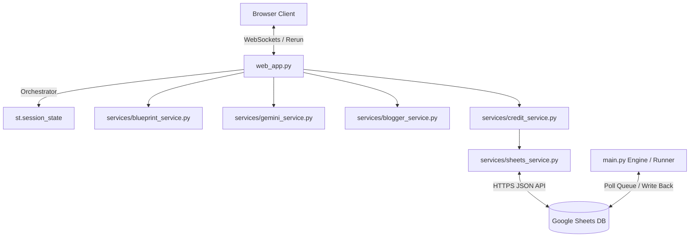

# Sprint 7 Architecture Audit: GetExpert AI Content Factory

This document audits the current monolithic Streamlit architecture and identifies key files, business logic modules, UI parts, and backend candidates to plan a migration to a self-hosted custom web application.

---

## 1. Current Streamlit Architecture Summary

The current application is a single-page web app built on **Streamlit**. 

*   **Rerun Lifecycle:** Every user interaction (button click, text input change, tab switch) triggers a full-top-down rerun of `web_app.py`.
*   **State Management:** State is stored in memory using `st.session_state` (e.g. user authentication emails, verified eligibility statuses, loaded content history, temporary form inputs).
*   **Database Integration:** The app uses Google Sheets as a low-cost transactional database via `services/sheets_service.py`. 
*   **Background Worker:** `main.py` is a standalone background runner that polls Google Sheets for queue items marked as `Waiting`, calls the Gemini API to write strategy packs, creates drafts in Blogger, and writes back status updates to Google Sheets.

---

## 2. Important Files and Modules

The critical business rules are decoupled from Streamlit and reside in the following Python modules:

| Component | Path | Description & Preserved Logic |
| :--- | :--- | :--- |
| **User & Log Models** | [`models/credit_models.py`](file:///c:/AI%20Automate/getexpert-ai-content-factory/models/credit_models.py) | Defines `UserCredit`, `UsageLog`, and `PaymentRecord` schemas. |
| **Content Models** | [`models/content_models.py`](file:///c:/AI%20Automate/getexpert-ai-content-factory/models/content_models.py) | Defines `SheetRow` (36 columns) and `SEOContent` schemas. |
| **Sheets Database** | [`services/sheets_service.py`](file:///c:/AI%20Automate/getexpert-ai-content-factory/services/sheets_service.py) | Low-level Sheets queries, row-padding, retries, and CRUD operations for `Users`, `Payments`, and `Referral Logs`. |
| **Credit Gate** | [`services/credit_service.py`](file:///c:/AI%20Automate/getexpert-ai-content-factory/services/credit_service.py) | Decides eligibility (3 free trials per email, paid credit checks), manages referral logic mapping on registration. |
| **AI Blueprints** | [`services/blueprint_service.py`](file:///c:/AI%20Automate/getexpert-ai-content-factory/services/blueprint_service.py) | Holds strategies, roles, writing parameters, and prompt builders for different content blueprints. |
| **AI Generation** | [`services/gemini_service.py`](file:///c:/AI%20Automate/getexpert-ai-content-factory/services/gemini_service.py) | Coordinates system instruction compiling and structures LLM prompts for Gemini. |
| **Blogger Integration** | [`services/blogger_service.py`](file:///c:/AI%20Automate/getexpert-ai-content-factory/services/blogger_service.py) | Performs OAuth tokens handling and pushes drafts into Blogger endpoints. |
| **Core Engine** | [`main.py`](file:///c:/AI%20Automate/getexpert-ai-content-factory/main.py) | The backend worker process that handles AI generation queues asynchronously. |

---

## 3. UI-Only Parts (Streamlit Dependencies)

The following parts inside [`web_app.py`](file:///c:/AI%20Automate/getexpert-ai-content-factory/web_app.py) are purely visual and can be completely replaced by custom HTML, CSS, and Javascript in a custom web application:

*   **Dynamic Inputs:** Streamlit widgets (`st.text_input`, `st.selectbox`, `st.form`) that capture user keywords, topics, and blueprints.
*   **Payment Gate Layout:** Rendering of the payment instructions, the dynamic LINE OA button, QR Code images, and copy-paste helper blocks.
*   **Strategy Tabs:** The 5 tabs (`st.tabs`) representing Blogger, Facebook, TikTok, YouTube, and Midjourney Prompts.
*   **My Content History:** The card components (`st.container`, `st.expander`) displaying historical content packs.
*   **Admin Panel:** The search bar, partner toggle controls, and log tables for manual referral and credit adjustments.

---

## 4. Backend Service Candidates

In the target architecture, all Python modules in `services/` will be wrapped by a **FastAPI** web server to act as REST API endpoints (`api.getexpert.biz`). The main candidates for endpoints are:

### User & Authorization API
*   `POST /api/user/verify`: Verifies user email, checks credits, and returns `UserCredit` fields (is partner, referrer, credits count).
*   `POST /api/user/register`: Registers a new user (with optional referrer code).

### Content Engine API
*   `GET /api/blueprints`: Returns lists of available content blueprint parameters.
*   `POST /api/content/generate`: Adds a generation request to the queue (Standard Mode) or generates immediately (Demo Mode).
*   `GET /api/content/history`: Fetches past content packs created by a specific user email.

### Admin & Billing API
*   `POST /api/admin/referral/activate`: Activates referral partner status for a user, registers a unique code, and builds a referral link.
*   `POST /api/admin/credit/add`: Records payments in sheets and updates credit balances.
