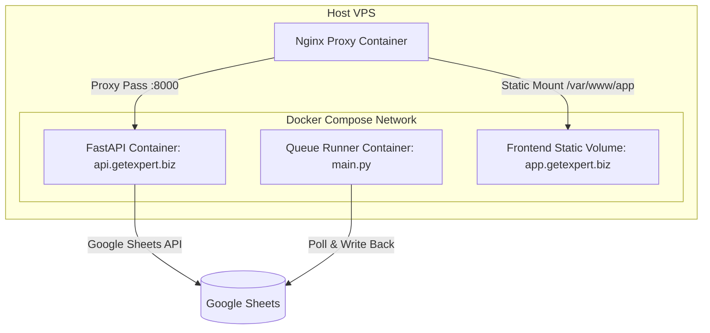

# Sprint 7 Docker & VPS Deployment Plan: GetExpert AI Content Factory

This document details the target self-hosted Docker architecture, port assignments, Nginx reverse proxy routing, and SSL configurations to migrate the application away from Streamlit Cloud to a custom VPS environment.

---

## 1. Proposed Future Network & Domain Structure

The target setup maps domains to specific components as follows:

```
                  ┌────────────────────────────────────────┐
                  │          Nginx Reverse Proxy           │
                  │             (Port 80/443)              │
                  └──────┬────────────┬────────────┬───────┘
                         │            │            │
      ┌──────────────────┘            │            └──────────────────┐
      ▼                               ▼                               ▼
Landing Page                     Customer App                     FastAPI Backend
getexpert.biz                  app.getexpert.biz                 api.getexpert.biz
(Static HTML/CSS)               (Static JS SPA)                 (Port 8000 Container)
```

*   **getexpert.biz (Landing Page):** A fast, SEO-optimized static marketing page highlighting features, blueprints, pricing (99 Baht / 149 Baht), and a call to action.
*   **app.getexpert.biz (Customer Web App):** The user portal where logged-in users enter keywords/topics, verify their credits, view generation history, and access payment QR code gates.
*   **api.getexpert.biz (Python API Backend):** The unified backend serving API endpoints to the customer web app. Runs the FastAPI service and coordinates database reads/writes.

---

## 2. Proposed Docker Deployment Structure

The VPS hosting will orchestrate the runtime using **Docker** and **Docker Compose**. This ensures clean isolation, reproducibility, and minimal memory overhead on a standard Hostinger VPS.



### Docker Compose Configuration Template (`docker-compose.yml`)

```yaml
version: '3.8'

services:
  # 1. FastAPI Backend Service (api.getexpert.biz)
  api:
    build:
      context: .
      dockerfile: Dockerfile.api
    container_name: getexpert-api
    restart: always
    environment:
      - GOOGLE_SHEET_ID=${GOOGLE_SHEET_ID}
      - GEMINI_API_KEY=${GEMINI_API_KEY}
      - GOOGLE_CREDENTIALS_JSON=${GOOGLE_CREDENTIALS_JSON}
      - GOOGLE_TOKEN_JSON=${GOOGLE_TOKEN_JSON}
    ports:
      - "127.0.0.1:8000:8000"
    volumes:
      - ./logs:/app/logs

  # 2. Queue Runner Worker (main.py Engine)
  worker:
    build:
      context: .
      dockerfile: Dockerfile.worker
    container_name: getexpert-worker
    restart: always
    environment:
      - GOOGLE_SHEET_ID=${GOOGLE_SHEET_ID}
      - GEMINI_API_KEY=${GEMINI_API_KEY}
      - GOOGLE_CREDENTIALS_JSON=${GOOGLE_CREDENTIALS_JSON}
      - GOOGLE_TOKEN_JSON=${GOOGLE_TOKEN_JSON}
    volumes:
      - ./logs:/app/logs
```

---

## 3. Proposed VPS / Nginx / SSL Structure

### VPS Host Server Requirements (Hostinger or similar)
*   **OS:** Ubuntu 22.04 LTS (Clean installation).
*   **Specs:** 2 vCPU, 4GB RAM (Standard Starter VPS tier is enough since Python memory footprint is low).
*   **Security:** Firewall (UFW) active, blocking ports except 22 (SSH), 80 (HTTP), and 443 (HTTPS).

### Nginx Reverse Proxy Configuration (`/etc/nginx/sites-available/getexpert`)

```nginx
# 1. Landing Page config (getexpert.biz)
server {
    listen 80;
    server_name getexpert.biz www.getexpert.biz;
    
    root /var/www/getexpert-landing;
    index index.html;

    location / {
        try_files $uri $uri/ =404;
    }
}

# 2. Customer Portal App (app.getexpert.biz)
server {
    listen 80;
    server_name app.getexpert.biz;

    root /var/www/getexpert-app;
    index index.html;

    location / {
        try_files $uri $uri/ /index.html;
    }
}

# 3. FastAPI REST API (api.getexpert.biz)
server {
    listen 80;
    server_name api.getexpert.biz;

    location / {
        proxy_pass http://127.0.0.1:8000;
        proxy_set_header Host $host;
        proxy_set_header X-Real-IP $remote_addr;
        proxy_set_header X-Forwarded-For $proxy_add_x_forwarded_for;
        proxy_set_header X-Forwarded-Proto $scheme;
    }
}
```

### SSL Encryption (HTTPS) via Let's Encrypt
To encrypt all traffic and support HTTPS, we will use Certbot.

```bash
# 1. Install Certbot Nginx plugin
sudo apt update
sudo apt install certbot python3-certbot-nginx

# 2. Request SSL certificates and auto-update Nginx configs
sudo certbot --nginx -d getexpert.biz -d www.getexpert.biz -d app.getexpert.biz -d api.getexpert.biz

# 3. Verify automatic Certbot SSL certificate renewal
sudo certbot renew --dry-run
```
Once run, Certbot will automatically redirect all HTTP traffic to HTTPS (port 443) and manage TLS handshake configurations safely.
